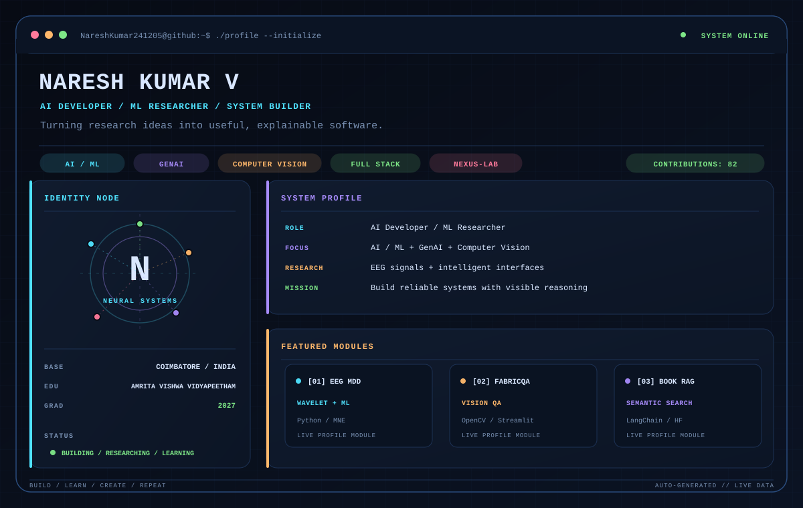
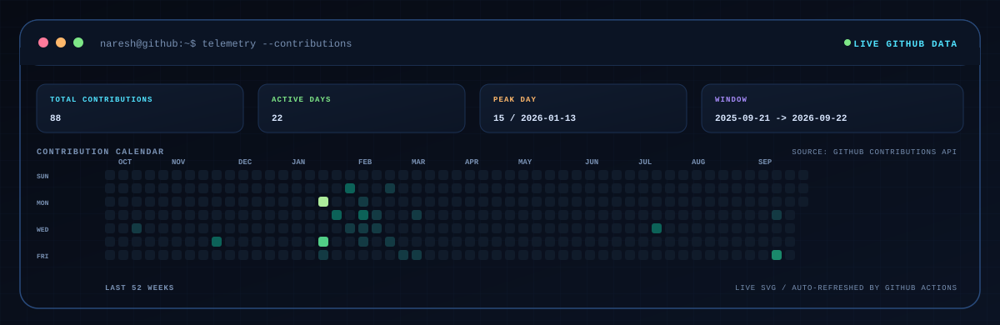

<div align="center">



<p>
  <a href="https://github.com/NareshKumar241205"></a>
  <a href="https://www.linkedin.com/in/nareshkumar241205/"></a>
  <a href="https://leetcode.com/u/Naresh_Kumar_2005/"></a>
</p>

</div>

## `~/activity`

<div align="center">



<sub>Contribution data is fetched from GitHub and the SVG is refreshed automatically.</sub>

</div>

## `~/about`

I am an AI student and developer at **Amrita Vishwa Vidyapeetham**, exploring how machine learning becomes useful software. My work sits where **AI/ML, Generative AI, computer vision, signal processing, and full-stack engineering** meet.

| Signal | Current state |
|:--|:--|
| Role | AI Developer and ML Researcher |
| Education | B.Tech CSE-AIE, Amrita Vishwa Vidyapeetham |
| Graduation | 2027 |
| Base | Coimbatore, India |
| Working style | Research deeply, build clearly, ship reliably |

## `~/stack`

| Domain | Tools and concepts |
|:--|:--|
| AI / ML | `PyTorch` `TensorFlow` `Keras` `Scikit-learn` `NumPy` `Pandas` |
| GenAI | `RAG` `LangChain` `Hugging Face` `Embeddings` `Semantic Search` |
| Computer vision | `OpenCV` `scikit-image` `LBP` `Gabor Filters` `FFT` `ORB` |
| Signal processing | `MNE` `PyEDFlib` `Kymatio` `Wavelet Scattering` |
| Full stack | `React` `Next.js` `TypeScript` `FastAPI` `Node.js` |
| Infrastructure | `Docker` `GitHub Actions` `Linux` `Vercel` `PostgreSQL` |

## `~/featured-projects`

### `[01]` [EEG-based MDD Detection](https://github.com/NareshKumar241205/eeg-wavelet-mdd)

Research-focused EEG analysis using Wavelet Scattering Transform and machine-learning classifiers for subject-level evaluation.

`Python` `MNE` `PyEDFlib` `Kymatio` `SVM` `Random Forest` `MLP`

### `[02]` [FabricQA - Automated Optical Inspection](https://github.com/NareshKumar241205/Fabrict-Defect-Detection)

Reference-free textile defect detection using classical computer vision, texture analysis, and statistical image processing.

`Python` `OpenCV` `Streamlit` `LBP` `Gabor Filters` `FFT`

### `[03]` [LLM-powered Book Recommendation](https://github.com/NareshKumar241205/LLM-powered-Book-Recommendation-System)

An intent-aware recommendation system combining semantic embeddings, emotion filtering, vector retrieval, and LLM-generated results.

`Python` `LangChain` `Sentence Transformers` `Gradio` `RAG`

### `[04]` [LSTM Melody Generator](https://github.com/NareshKumar241205/melody-generator)

An LSTM sequence model that learns musical patterns from MIDI files and generates new melodies.

`Python` `TensorFlow` `Keras` `NumPy` `music21` `MIDI`

## `~/next-system`

### NEXUS-Lab / Multimodal Research Workspace

`DESIGNING / PROTOTYPING`

A local-first research assistant for papers, images, and datasets. The goal is to connect document parsing, semantic retrieval, visual understanding, citation-aware answers, experiment tracking, and RAG evaluation in one explainable workspace.

`Next.js` `FastAPI` `LangGraph` `Qdrant` `PyMuPDF` `Ollama` `Docker`

> This is a future project direction, not a claim of a completed public repository.

## `~/learning`

```text
Advanced RAG      [================----] DEEPENING
Agentic AI        [==============------] EXPLORING
MLOps             [===========---------] LEARNING
```

These are directional labels, not numerical skill percentages.

## `~/contact`

| Channel | Link |
|:--|:--|
| GitHub | [@NareshKumar241205](https://github.com/NareshKumar241205) |
| LinkedIn | [linkedin.com/in/nareshkumar241205](https://www.linkedin.com/in/nareshkumar241205/) |
| LeetCode | [Naresh_Kumar_2005](https://leetcode.com/u/Naresh_Kumar_2005/) |

<div align="center">

```text
naresh@github:~$ echo "Build. Learn. Create. Repeat."
```

<sub>Profile visuals are generated from <code>scripts/generate_profile_assets.py</code>.</sub>

</div>
